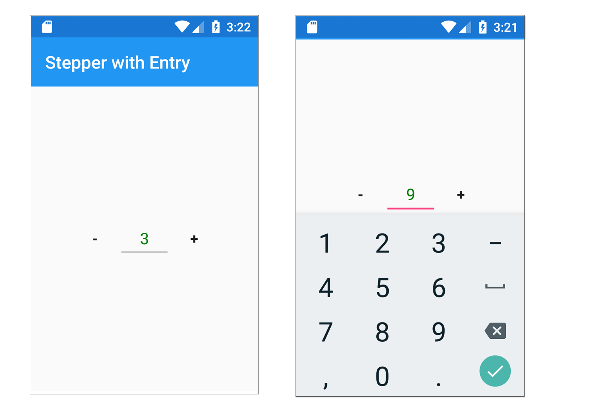

# Xamarin.Forms custom control: Stepper with  Entry

## Blog Post

I have written a [blog post on the implementation](https://lioncoding.com/2020/02/26/2020-02-26-controle-personnalise-en-xamarin-forms-un-stepper-disposant-d-un-entry/) over at [my blog](https://lioncoding.com).

# Contributions

I welcome pull requests and suggestions to improve the solution. Please just raise an issue or submit a pull request.
